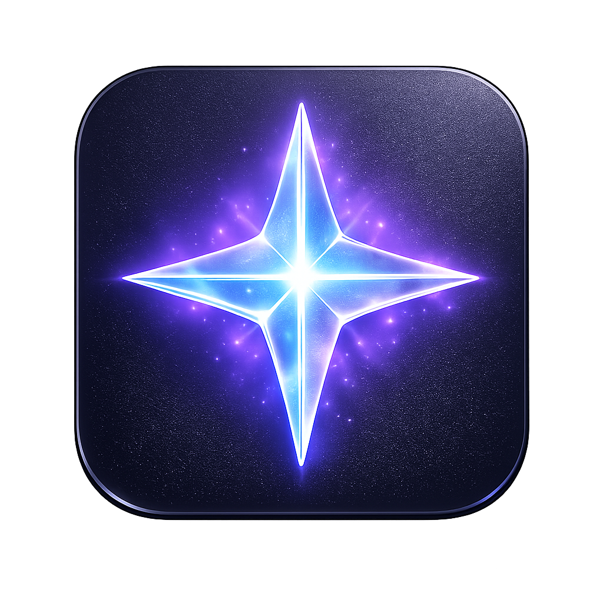

# Lumina AI

<div align="center">
  
  <br/>
  <br/>
  
  **A minimalist, privacy-focused local AI assistant.**
  
  Built with **Tauri**, **Rust**, and **React**. Powered by **Ollama**.

  [English](#english) | [Русский](#russian)
</div>

---

<a name="english"></a>
## 🇬🇧 English

### Overview
Lumina is a cross-platform desktop application designed to be a sleek, efficient, and private AI companion. It runs entirely on your local machine via Ollama.

### Features
*   **Vector Engine:** Ultra-crisp SVG logo integrated into the UI.
*   **Privacy First:** Local processing by default.
*   **System Integration:** Can analyze local system processes.

### How to Use
1.  **Prerequisite:** Download and install **[Ollama](https://ollama.com/)**.
2.  **Setup Model:** Open your terminal and run `ollama pull llama3` (or `mistral`, `gemma`, etc.).
3.  **Launch Lumina:** Start the application.
4.  **Configure:** Click the **Settings** (gear icon) to select your downloaded model if it doesn't appear automatically.
5.  **Chat:** Type your query. You can also use the "Check Processes" button to have the AI analyze your running system tasks.

### Development
```bash
npm install
npm run tauri dev
```

---

<a name="russian"></a>
## 🇷🇺 Русский

### Обзор
Lumina — это кроссплатформенное десктопное приложение, созданное как стильный, эффективный и приватный AI-помощник. Работает полностью локально через Ollama.

### Возможности
*   **Vector Engine:** Кристально чистый SVG-логотип, интегрированный в интерфейс.
*   **Приватность:** Все данные обрабатываются на вашем ПК.
*   **Интеграция:** Может анализировать системные процессы (MOCK).

### Инструкция по использованию
1.  **Требование:** Скачайте и установите **[Ollama](https://ollama.com/)**.
2.  **Установка модели:** Откройте терминал и выполните команду `ollama pull llama3` (или любую другую, например `mistral`).
3.  **Запуск:** Откройте приложение Lumina.
4.  **Настройка:** Нажмите на иконку **Настроек** (шестеренка), чтобы выбрать модель, если она не выбралась автоматически.
5.  **Чат:** Введите ваш запрос. Вы также можете нажать кнопку "Check Processes", чтобы ИИ проанализировал запущенные процессы.

### Разработка
```bash
npm install
npm run tauri dev
```

---

### Tech Stack
*   **Frontend:** React 19, Tailwind CSS, Framer Motion
*   **Backend:** Tauri 2.0 (Rust)
*   **AI Engine:** Ollama (Local)

### License
MIT
